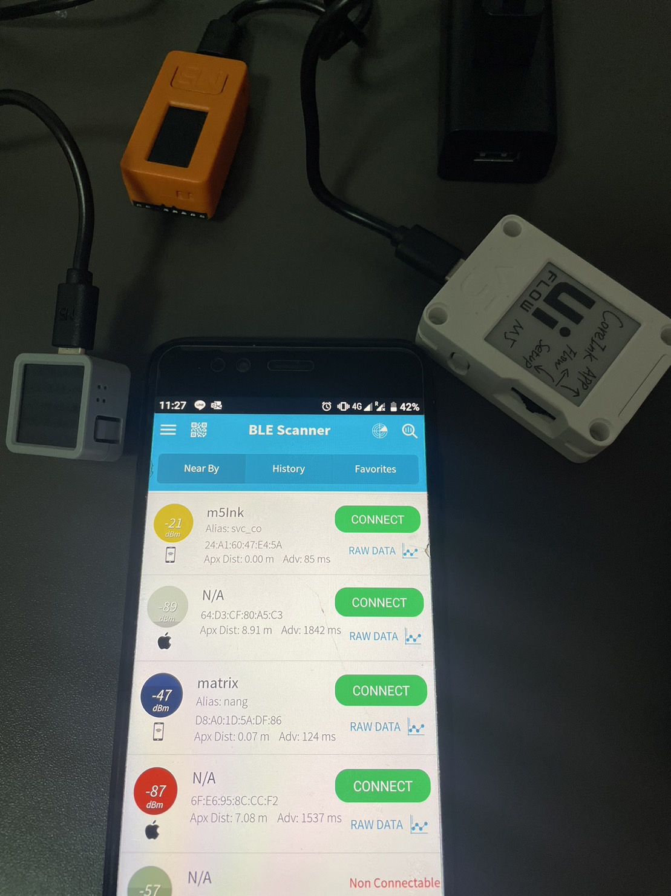

#BLE tags, **BLE Advertiser Code**

* In our project, we used other ESP32 hardware devices such as matrix, core ink and stick c as our BLE tags and that will be given to customer. The tags will be programmed in our code to transmit advertise BLE and the names of name tags will be set, have to be less than 6 characters.

* From BLE scanner app, we can collect the names, mac addresses and received signal strength values of BLE tags.

