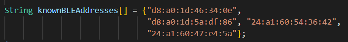

# SoftwareDesignAIoT
# Title: ***IoT-enabled Smart Ordering System***

### Members
1. Seng Nu Pan (sengnupan.kumgyi@gmail.com)
2. Kaung Htet San (kaunghtetsan275@gmail.com)
3. Khaing Zar Mon (m6522040556@g.siit.tu.ac.th)
4. Ei Thandar Phyu (eithandar.p@live.ku.th)
5. Hnyot Myet Wunn Shunn Le Maung (hnyotmyetwunnshunnle.m@live.ku.th)
6. Nang Aeindray Kyaw (nangaeindray.k@live.ku.th)

### Hardware
1. M5Stack Core2 (M5Stack Core2)
    * CP210x USB serial
    * LCD 320x240
    * 6-axis IMU MPU6886
2. M5Stack Basic (M5Stack Core ESP32)
    * CP210x USB serial
    * LCD 320x240
3. M5 CoreInk (M5Stack Core Ink)
    * CP210x USB serial
    * E-ink 200x200
4. M5StickC (M5Stick-C)
    * FTDI USB serial
    * LCD 80x160
    * 6-axis IMU MPU6886
5. ATOM Echo (M5Stack-ATOM)
    * FTDI USB serial
6. ATOM Matrix (M5Stack-ATOM)
    * FTDI USB serial
    * LED 5x5
    * 6-axis IMU MPU6886

## Objectives
1. To facilitate remote management and tracking order data.
2. To make ordering process more convenient and achieve customer satisfaction.

***User stories and acceptance criteria***

1. As a **Customer**, I want to ***order food easily*** so that ***I will be satisfied.***
    * Scenario : ***Customer arrives***, given ***customer is in the shop with BLE Tag***, when ***customer scan the QR code***, then ***the menu will be displayed with beep beep sound.***
    * Scenario: ***Customer browses the menu***, given ***customer reads the menu***, when ***customer has chosen the menu***, then ***the order will be added to the shopping cart.***
    * Scenario: ***Customer comfirms the orders***, given ***the order list is in the shopping cart***, when ***the order is confirmed***, then ***updated order list will be displayed to the kitchen.***
    * Scenario: ***Receive the order***, given ***the order list***, when ***the kitchen staff receives the order***, then ***the order will be  prepared and recorded in the database.***
    * Scenario: ***Order notification***, given ***the customer is in the queue***, when ***the order is ready***, then ***the customer will be notified***.

2. As a ***Shop Owner***, I want to ***see the dashboard and statistics*** so that ***I can overview and manage the shop.***
    * Scenario: ***Sales Report*** given ***the records from database*** when ***the shop owner selects the query,*** then ***the corresponding report will be displayed.***
    

### System Architecture and Behavior

User Interface (UI) and Web Server
Software system consists of **user interface, web server and database**. The firmware is developed for M5 Atom Echo and M5StickC. The web server is developed using the **FLASK framework, Docker **. The database is developed using the **MongoDB database**.


* Customer can access the menu by **scanning the QR code**.


* **For the customer side:** when a customer selects a menu and submits an order, the order list is added to the database and the consumer is notified that the order has been placed. <br>
**For the kitchen staff side:** the web page that the kitchen staff sees is refreshed every 10 seconds, and the order list is shown on the desktop screen of the kitchen staff. <br>


* Once the kitchen staff finishes preparing an order, they will use the website to indicate that it is ready. This will trigger an update to the order status in the database and a message will be sent to the MQTT broker indicating that the order is ready. When this message is received by core2, it will notify the customer that their order is now ready to be served. <br>


* After the customer finished their meal, they can pay for their meal by scanning the QR code. The payment will be recorded in the database. <br>

<!-- * The business owner can **review the sales record and update the menu** when the demand changes. -->
<!--  -->


### Member's Contribution 
***The strength of the team is each individual member. The strength of each member is the team." – Phil Jackson***

**Seng Nu Pan**

Hello there! I am a contributor who has the responsibility for creating **The Dashboard** of our system. <br>


I have implemented **Four functions** to help owner see the insights.
<br>

* Function 1
<br>

1_a: The owner can see **the available menu list**.
<br>


<br>

1_b: The owner can **select each menu id and check details**
<br>


<br>

* Function 2
<br>

The owner can check **the number of orders for selected date**.
<br>


<br>

* Function 3
<br>

***What will be the top most popular dish of my shop?*** Yes, the owner can check it out with this function.
<br>


<br>

* Function 4
<br>

***By the way, how much money have I earned so far?*** Yes, the owner can check it out with this function.
<br>


<br>

* Test Case
<br>


* Result

***The following figure is the Dashboard what the owner see.***
<br>


<br>

***The following figure is the flow behind it.***
<br>


**Khaing Zar Mon**

Hello there! I am a contributor who has the responsibility for creating **Shopping Cart and Display the order list to the Kitchen Staff** of our system. <br>

**Shopping Cart:** When a customer adds items to their shopping cart, they can update or remove items, and when they click "Order" the order is placed, the order list and table number are added to the **open order collection**. Then the order status is updated to "order processing".<br><br>


**Display the order list to the kitchen staff:** Every 10 seconds, the screen will refresh to show the list of orders that are currently being processed. If an order is ready, a staff member will click the "Order Ready" button to notify the client with sound via the M5Core2 device, and the order list will be dropped by table number from the kitchen staff's screen and the order status will be updated from "order processing" to "finished" in the **open order collection**. <br><br>


**Kaung Htet San**

Hello there! I am a contributor who has the responsibility for creating **Payment and Invoice** of our system. <br>

## Payment and Invoice
The payment and invoice are done by the **QR code**. The customer can **scan the QR code** to pay the bill. The **QR code** is generated by the **M5Stack Core2**. Once the QR code is scanned, the orders from the **open order collection** will be fetched for display of invoice and the **payment** will be **completed**.<br>
Before the final display of the invoice, the user will be given an option to **enter the coupon code** for eligible promotion.<br>

The total cost will be updated accordingly. The **invoice** will then be **generated** and **sent to the customer**. The server will **delete the record** from open order collection by the table number. The **invoice** will be **stored** in the **order collection**. Finally, the user can download the invoice in **PDF** format.

<hr>
<br>

**Hnyot Myet Wunn Shunn Le Maung** 

Hello there! I am a contributor who has the responsibility for creating **hardware proximity detection and QR code creation** for our ordering system. <br>
**Hardware list- BLE tags and M5 Core 2** <br>
1.BLE tags- will be given when customer arrives. <br>
2.M5 Core 2- At each and every table, M5core 2 will be placed for our smart ordering system. <br>

#BLE tags, **BLE Advertiser Code**

* In our project, we used other ESP32 hardware devices such as matrix, core ink and stick c as our BLE tags and that will be given to customer. The tags will be programmed in our code to transmit advertise BLE and the names of name tags will be set, have to be less than 6 characters.
* From BLE scanner app, we can collect the names, mac addresses and received signal strength values of BLE tags.
 <br> 

#M5 Core 2, **BLE detector**

* Core 2 will work as BLE detector and will be detecting every BLE devices nearby. RSSI threshold is set. We can also change the ```RSSI_THRESHOLD``` for any desire values as this threshold will depend on the environment being noisy or not.


* We will make a list of registered BLE devices. Collected BLE tags will be added to the known BLE devices list.
 <br>
* Firstly, the Core 2 will check whether the detected BLE devices are included in the known BLE devices list. If yes, the BLE mac addresses will be compared and displayed on serial monitor as” Found Registered Device” with their respective received signal strength values.


* If the value of registered BLE device is within our set RSSI value, beep beep alarm will be played with M5 core 2’s built in speaker and Menu QR code for that table will be displayed on LCD. 

 <br>


<br>

**Nang Aeindray Kyaw**

Hello everyone! I am a contributor who has the responsibility for creating the **Restaurant Menu Page and Orders Cart** of our system. The GUI and the usage are as follows:<br>

**Browse the menu:**
* By scanning the QR code, the system open the web browser and go to the menu page.<br>
* The menu items will be displayed, organized by categories "Main Dish" and "Desserts".<br>
* Click the "Add" button below each item to add it to the cart.<br><br>


**View the cart:**
* Click "Your Orders" button in the top right corner of the screen.<br>
* The cart will be displayed, showing all items that have beeen added.<br>
* Adjust the quantity of an item by clicking the "+" and "-" buttons.<br>
* Remove an item from the cart by clicking the "Remove" button next to it.<br>
* Clear the entire cart by clicking the "Empty Cart" button.<br>
* Click the "Order" button and the order will be placed.<br>


**Ei Thandar Phyu**<br><br>
I am a contributor who has the responsibility for Order Notification and Button Actions on M5Stack Core2. <br>

**Order Notification**  
* On M5Stack Core2 device, the WiFi will be initialized and a topic will be subscribed. The program will then wait for a message from the kitchen staff informing that an order is ready. When the kitchen staff presses the "Order Ready" button, the order status in the database will be updated and a message will be sent to the MQTT broker. <br><br>


* When Core2 receives a message from the subscribed topic, it will check the table number and verify that the message is "Order Ready". If the valid table number and order ready message were received, the customer will be notified that his order is ready to serve. <br><br>


**Button Actions**
* The button actions on Core2 will only be enabled once the BLE tag is detected. If the customer clicks the Order button (btnA) on Core2, a QR code will be displayed to order again. <br>

* The customer can also subscribe to our Kitchen Line Bot by clicking the Line Bot button (btnC) on Core2 and scanning a QR code. <br><br>


* To request an invoice, the customer can click the Payment button (btnB) on Core2. To prevent cases where the customer presses the Payment button (btnB) on Core2 before placing an order, Core2 will send a request to the server using MQTT protocol to check whether any orders have been placed for the table when the customer clicks the Payment button. The server will then check the order for this table in the database and send a message back via MQTT protocol. If there are no orders, the customer will be notified that they need to place an order first. If there are orders, a QR code for the invoice will be displayed. <br><br>


* After the payment process is complete, Core2 will begin detecting BLE tags.
